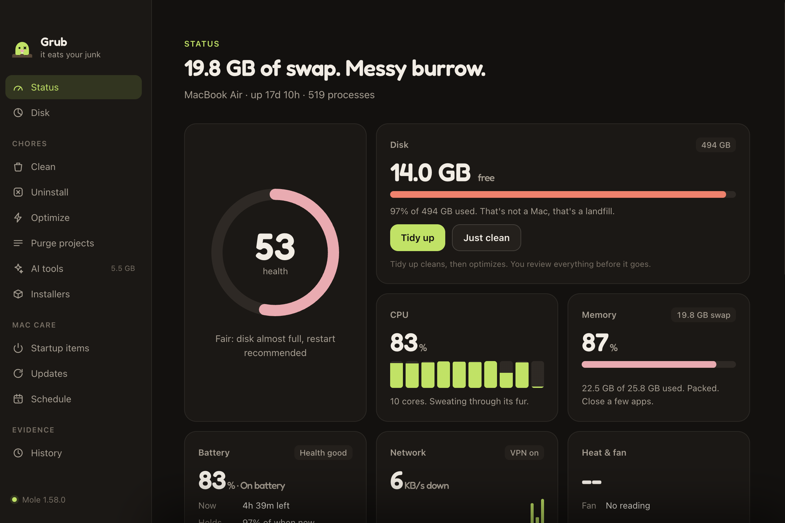
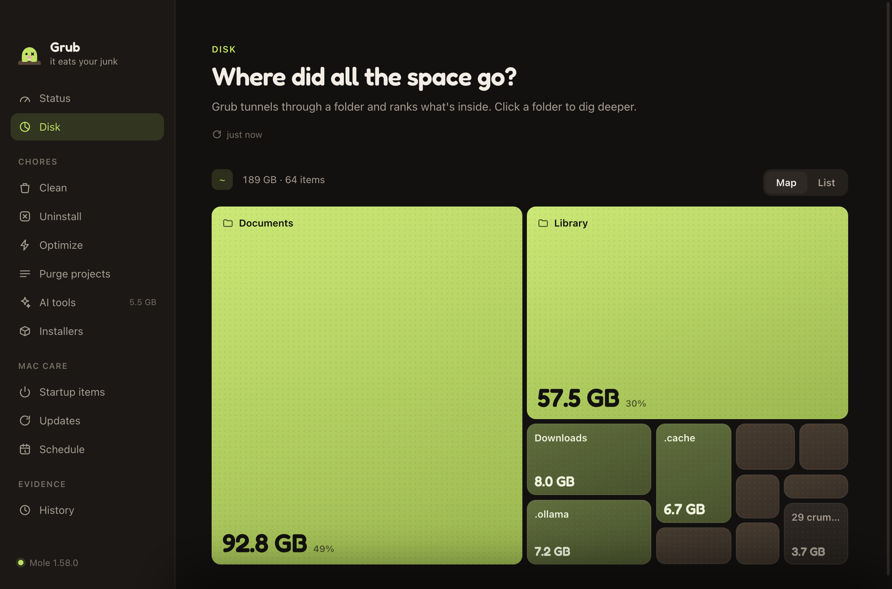
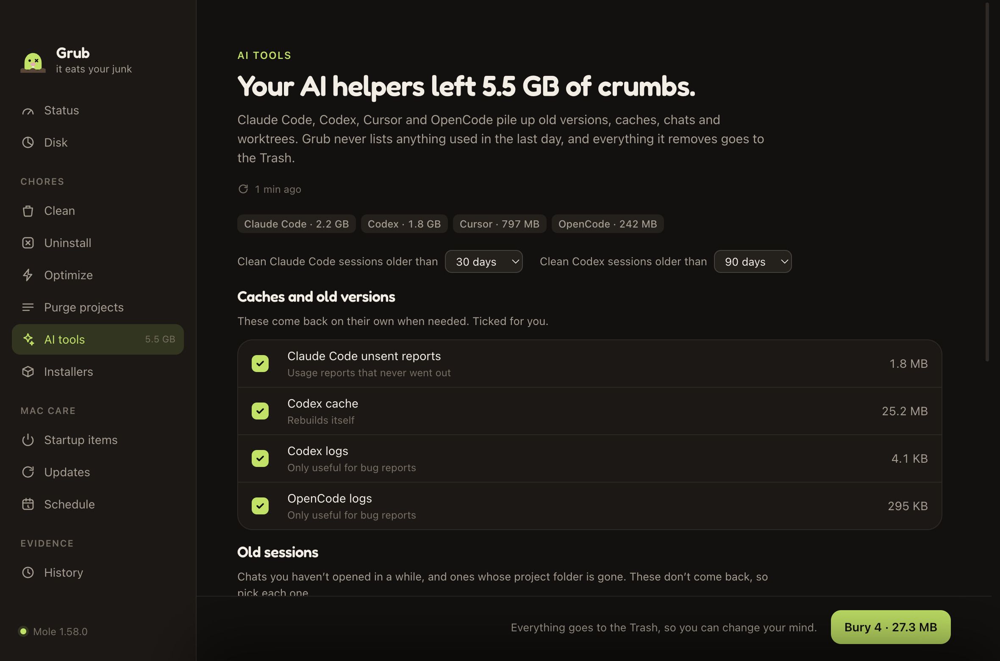
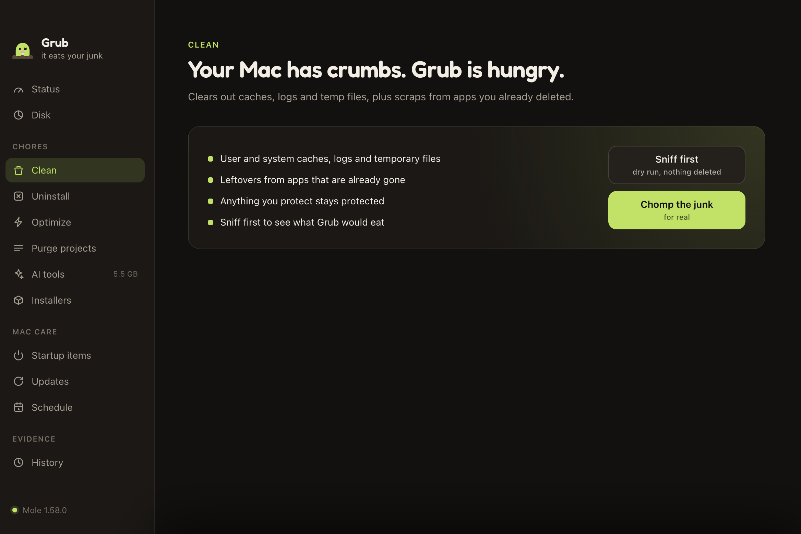
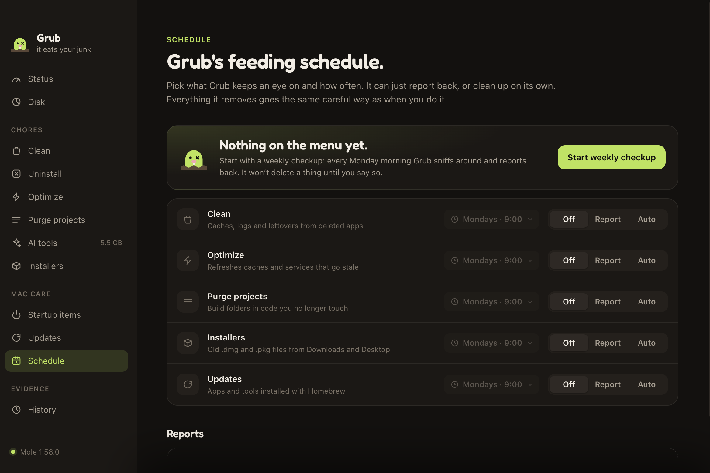

# Grub

[](https://github.com/nkrrish/grub/releases/latest)
[](https://github.com/nkrrish/grub/releases)
[](https://grub.attechy.com)
[](LICENSE)

It eats your junk. Grub is a free, open-source Mac cleaner: a live health dashboard, a disk map you can dig through, guided cleanups, full app uninstalls, startup-item control, app updates and menu bar stats, all in one place. Its cleaning runs on the open-source [Mole](https://github.com/tw93/Mole) engine.

Grub isn't affiliated with Mole. It drives the `mo` command installed on your Mac and does not contain any of Mole's code.

<p align="center">
  <a href="https://grub.attechy.com"><b>grub.attechy.com</b></a> ·
  <a href="https://grub.attechy.com/download"><b>Download for Mac</b></a>
</p>



| Disk map | AI tools cleanup |
| --- | --- |
|  |  |
| **Clean** | **Schedule** |
|  |  |

## Install

1. Download Grub for [Apple Silicon](https://grub.attechy.com/download/apple-silicon) or [Intel](https://grub.attechy.com/download/intel). Not sure which? [grub.attechy.com](https://grub.attechy.com) picks for you.
2. Open the DMG and drag Grub into Applications.
3. Open Grub. First launch installs Mole (through [Homebrew](https://brew.sh)) and walks you through the permissions it needs.

Needs macOS 12 or later. Grub updates itself: new versions download in the background and install when you quit.

## Is it safe?

- Every release is signed with a Developer ID and notarized by Apple.
- "Sniff first" runs any clean as a dry run, so you see what would go before anything does.
- Grub's own cleanups (AI tools) send files to the Trash, and an app is only uninstalled after you review what's removed.
- Your admin password goes straight to `sudo` and is never stored.
- No account, no analytics, no tracking. The code is all here.

Found a security problem? See [SECURITY.md](SECURITY.md).

## Build from source

```bash
brew install mole
npm install
npm start
```

## How it works

- Status, Disk, Uninstall and History read Mole's JSON output (`mo status --watch`, `mo analyze --json`, `mo uninstall --list`, `mo history --json`).
- Clean, Optimize, Purge, Installers and Uninstall run Mole in a hidden terminal. Grub reads its screens and answers its prompts from its own UI: progress cards, checklists for installers and build artifacts, a review sheet before an app is removed, and a password sheet for admin steps (the password goes straight to `sudo` and is never stored). "Watch Grub work" shows the real terminal. "Sniff first" always adds `--dry-run`.
- First launch walks through setup: installing Mole if it's missing, Full Disk Access, System Events access, open-at-login and automatic Mole updates (`brew upgrade mole`, at most once a day). The version number in the sidebar opens About, with credits, the same settings, Grub's own version and a button to check for updates.
- The menu bar shows free disk space next to the icon (CPU and memory can be added, or nothing at all), and has a popover with live stats and quick actions. Both are set from the popover's customize button. Closing the window keeps it running there; quit from the popover.
- Tidy up runs `mo clean` and then `mo optimize` in one go.
- Startup items lists login items (via System Events) and launch agents. Your own agents can be switched off with `launchctl`; system ones open in Finder.
- AI tools finds what Claude Code, Codex, Cursor and OpenCode leave behind: old versions, caches and logs (ticked), old or orphaned sessions (you pick each; retention per tool), finished Claude Code worktrees (clean ones only, removed with `git worktree remove`) and an oversized OpenCode database to compact. Mole has no command for this, so Grub does it itself. Nothing used in the last day is listed, files go to the Trash, and Codex sessions are deleted with Codex's own `codex delete` after a copy goes to the Trash. It only appears in the sidebar when there's AI tool data, and can be hidden in About.
- Updates lists outdated Homebrew apps and tools (`brew outdated`) and upgrades them in the terminal.

## Contributing

Bug reports, ideas and pull requests are welcome. Start with [CONTRIBUTING.md](CONTRIBUTING.md), and take questions to [Discussions](https://github.com/nkrrish/grub/discussions).

## License

Grub is free software under the GNU GPL v3.0 or later (see `LICENSE`), the same license as Mole. Anyone may use, change and share the code, but changed versions must stay GPL-3.0 and ship their source.

The Grub name, logo, mole mascot and app icon are **not** covered by that license (see `NOTICE`). Forks need their own name and artwork.

Mole itself is GPL-3.0 and belongs to its authors.
